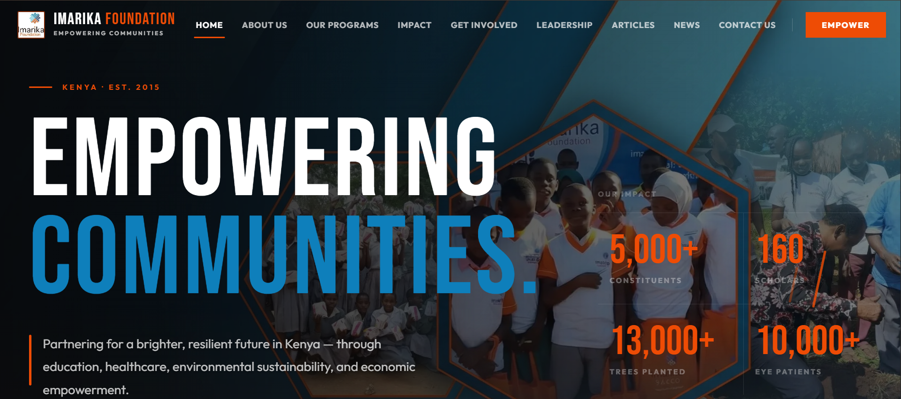
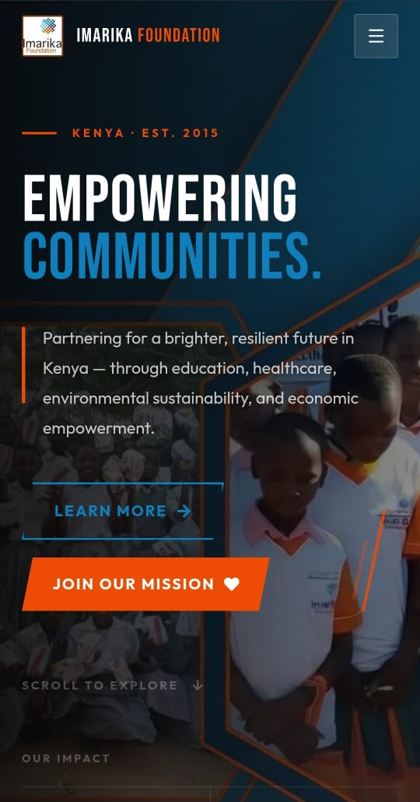
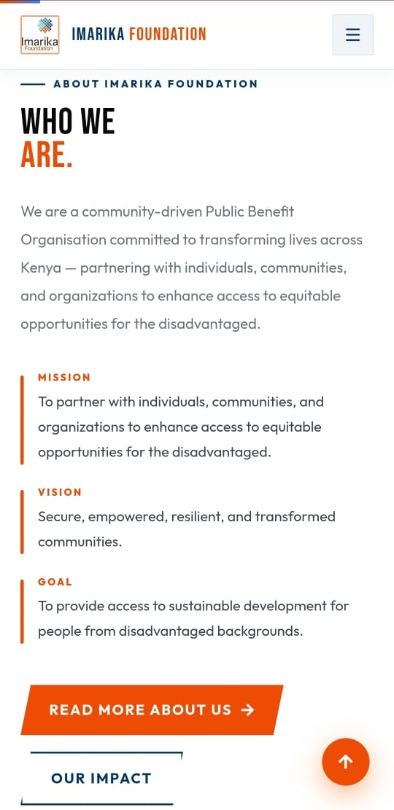
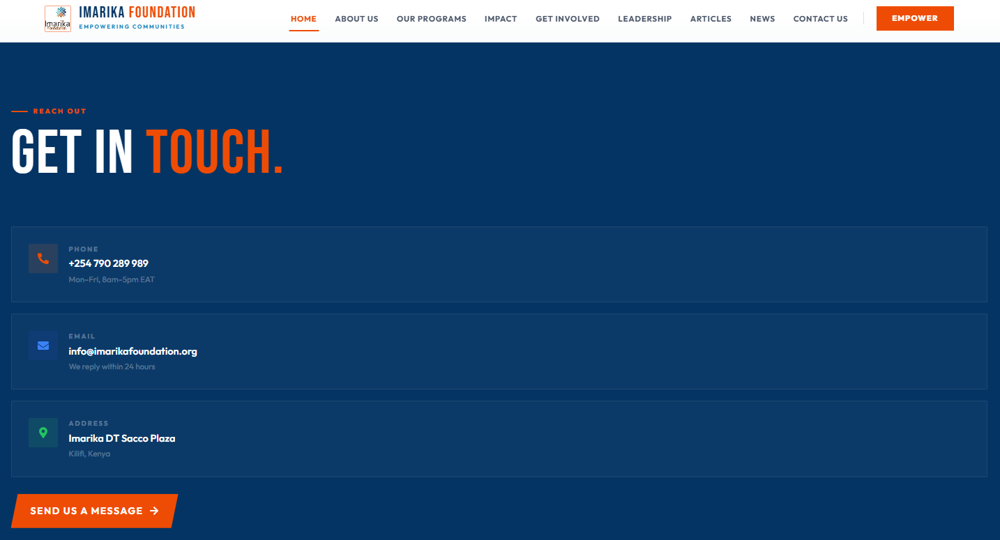
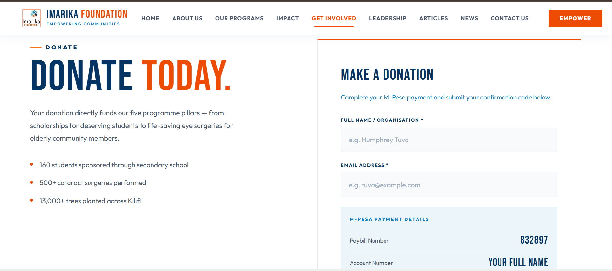
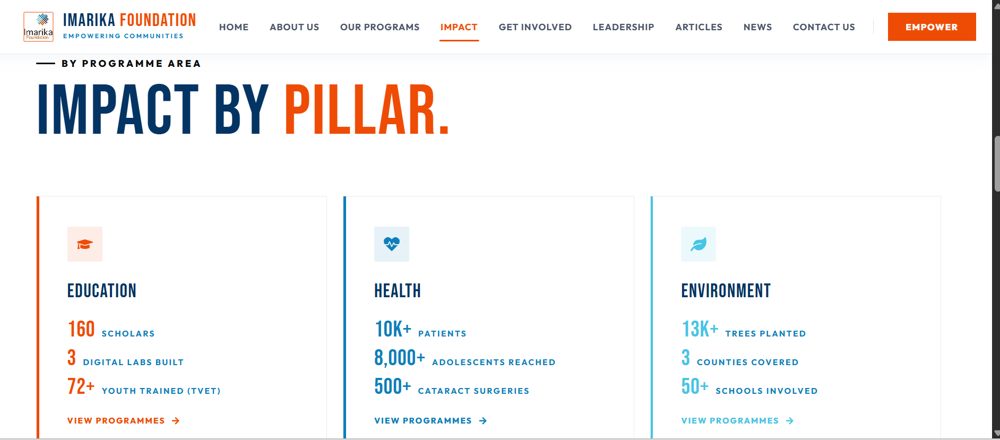
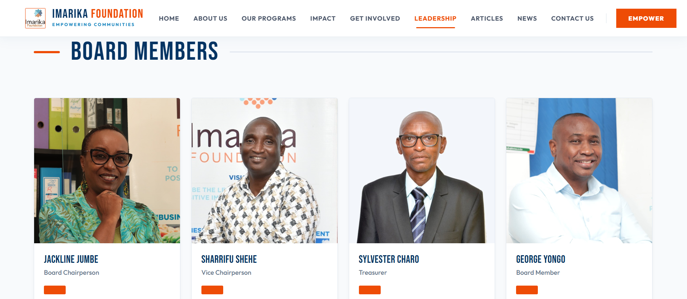
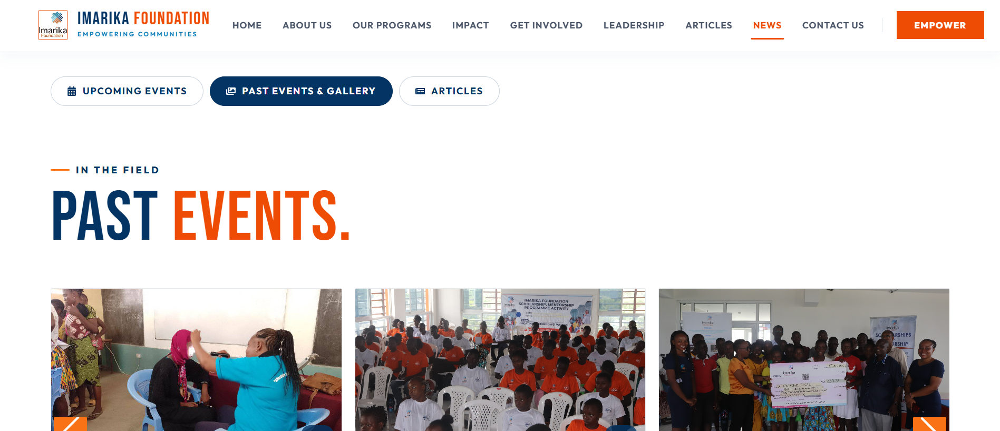
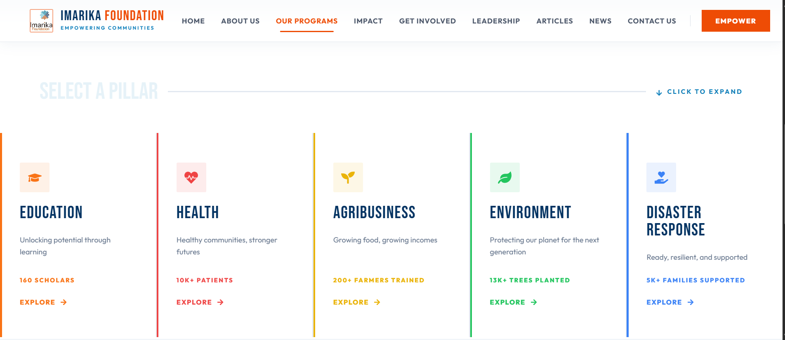

# Imarika Foundation Website

## Project Information

**Client:** Imarika Foundation  
**Role:** Full-Stack Software Engineer  
**Duration:** June 2025 – Present  
**Status:** Production / Live  
**Website:** [https://imarikafoundation.org](https://imarikafoundation.org)

## Responsibilities

- Gathered requirements from foundation leadership and stakeholders
- Designed and developed the React frontend
- Designed and developed the Django REST API backend
- Implemented JWT authentication and protected administrative endpoints
- Designed database models and content management workflows
- Deployed and maintained the production environment
- Diagnosed and resolved production issues and feature requests

## Overview

Imarika Foundation is a web platform for showcasing the foundation's programs, stories, events, leadership, and impact data.
It combines a React frontend with a Django REST backend to deliver both public-facing content and administrative management functionality.

## Live Website

🌐 [Imarika Foundation](https://imarikafoundation.org)  
The platform is currently deployed and actively used by the organization.

## Project Highlights

- 20+ API endpoints developed
- 10+ content management modules
- Mobile-responsive design
- Production deployment on Safaricom domains
- Dynamic management of articles, programs, events, leadership, and impact data
# Imarika Foundation Website

## Project Information

**Client:** Imarika Foundation  
**Role:** Full-Stack Software Engineer  
**Duration:** June 2025 – Present  
**Status:** Production / Live  
**Website:** [https://imarikafoundation.org](https://imarikafoundation.org)

## Overview

Imarika Foundation is a web platform for showcasing the foundation's programs, stories, events, leadership, and impact data.
It combines a React frontend with a Django REST backend to deliver both public-facing content and administrative management functionality.

## Responsibilities

- Gathered requirements from foundation leadership and stakeholders
- Designed and developed the React frontend
- Designed and developed the Django REST API backend
- Implemented JWT authentication and protected administrative endpoints
- Designed database models and content management workflows
- Deployed and maintained the production environment
- Diagnosed and resolved production issues and feature requests

## Live Website

🌐 [Imarika Foundation](https://imarikafoundation.org)  
The platform is currently deployed and actively used by the organization.

## Project Highlights

- 20+ API endpoints developed
- 10+ content management modules
- Mobile-responsive design
- Production deployment on Safaricom domains
- Dynamic management of articles, programs, events, leadership, and impact data

## Overview (Problem & Solution)

### Problem

The foundation needed a modern online presence that could share impact information, collect volunteer and partner submissions, manage programs and events, and present testimonials.
Existing static sites could not handle dynamic content updates, media uploads, or secure administrative workflows.

### Solution

This project solves the problem by providing:
- A responsive React website for visitors and donors
- A Django REST API for structured data delivery
- Submission endpoints for volunteers, partners, donations, and contact messages
- Administrative APIs for managing articles, leadership content, programs, events, and impact stories

## Features

- Public content pages and article listing
- Event management with image uploads
- Volunteer, partner, and donation submission forms
- Leadership and testimonial sections
- Impact and programs data endpoints for rich content rendering
- JWT authentication for protected admin APIs
- Media management via Django `MEDIA_ROOT`

## Repository Structure

```text
imarika-foundation/
├── backend/        # Django REST API
├── frontend/       # React application
├── screenshots/    # Project screenshots
├── docs/           # Architecture and deployment documentation
└── README.md
```

## Tech Stack

### Frontend
- React
- React Router
- Axios
- Tailwind CSS

### Backend
- Django
- Django REST Framework
- Simple JWT

### Database
- PostgreSQL (Production)
- SQLite (Development)

### Deployment
- Safaricom Domains
- Gunicorn
- Nginx

## Screenshots











## Quick Start

### Backend

```bash
cd backend
pip install -r requirements.txt
python manage.py migrate
python manage.py runserver
```

### Frontend

```bash
cd frontend
npm install
npm start
```

Deploy the frontend build and backend API to Safaricom-managed domains.
Update production API URLs and `CORS_ALLOWED_ORIGINS` to reference the Safaricom frontend domain.

## Deployment

### Backend

```powershell
cd backend
python -m venv venv
venv\Scripts\Activate.ps1
pip install -r requirements.txt
python manage.py migrate
python manage.py collectstatic
python manage.py runserver
```

### Frontend

```powershell
cd frontend
npm install
npm run build
```

Deploy the frontend build and backend API to Safaricom-managed domains.
Update production API URLs and `CORS_ALLOWED_ORIGINS` to reference the Safaricom frontend domain.

## Challenges Solved

- Built a dynamic website with both public and admin-facing content
- Implemented file upload support for events and leadership profiles
- Added structured impact and programs data endpoints for frontend consumption
- Provided secure token-based authentication for admin routes

## Lessons Learned

- Building for non-technical stakeholders requires clear communication and iterative feedback loops.
- Production deployments require careful handling of media files, static assets, and environment configuration.
- Content-heavy platforms benefit from reusable API structures and scalable data models.
- Responsive design must be considered from the beginning to ensure a consistent user experience across devices.

## Impact

- Improves digital visibility for Imarika Foundation
- Enables easier content updates and storytelling
- Supports volunteer, partner, and donation intake
- Centralizes mission-critical data for stakeholders

## Future Improvements

- Add user roles and admin dashboard UI
- Harden production security by restricting permissive endpoints
- Move environment configuration to environment variables
- Replace development SQLite with managed PostgreSQL in production
- Expand analytics and reporting for fundraising and outreach
